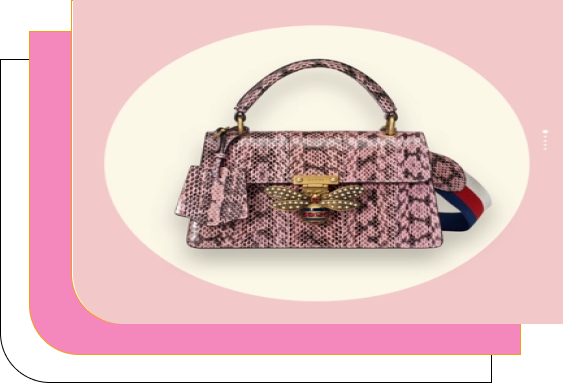
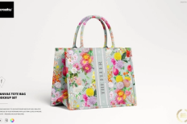
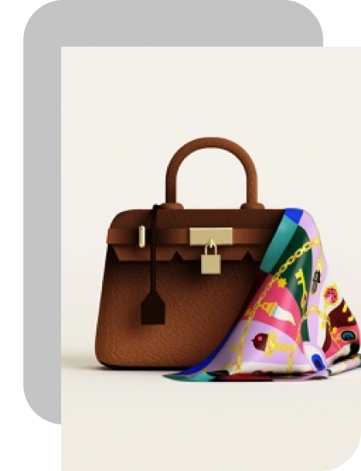

<!doctype html>
<html lang="en">
  <head>
    <!-- Required meta tags -->
    <meta charset="utf-8">
    <meta name="viewport" content="width=device-width, initial-scale=1, shrink-to-fit=no">

    <!-- Bootstrap CSS -->
    <link rel="stylesheet" href="frontend/libraries/bootstrap/css/bootstrap.css">
    <!-- MY CSS -->
    <link rel="stylesheet" href="frontend/styles/main.css">

    <!-- Google Fonts -->
    <link href="https://fonts.googleapis.com/css2?family=Montserrat:wght@100;200;300;400;500;600;700;800&family=Poppins:wght@100;200;300;400;500;600;700&display=swap" rel="stylesheet">

    <title>Home</title>
  </head>
  <body>

    <!-- Header -->
    <header>
      <nav class="navbar navbar-expand-lg navbar-light bg-dark fixed top">
        

          <a class="navbar-brand" href="#">RnB'BAGSTORE</a>
          <button class="navbar-toggler" type="button" data-toggle="collapse" data-target="#navbarNav" aria-controls="navbarNav" aria-expanded="false" aria-label="Toggle navigation">
            
          </button>
          

            <ul class="navbar-nav ml-auto">
              <li class="nav-item">
                <a class="nav-link active" href="#">Home</a>
              </li>
              <li class="nav-item">
                <a class="nav-link" href="#">Categories</a>
              </li>
              <li class="nav-item">
                <a class="nav-link" href="pages/Detail_Page.html">Products</a>
              </li>
              <li class="nav-item">
                <a class="nav-link" href="#">Sign Up</a>
              </li>
              <li class="nav-item">
                <a class="nav-link" href="#">Sign In</a>
              </li>
            </ul>
          

        

      </nav>
    </header>
    <!-- Tutup Header -->

    <!-- Hero Section -->
    <section class="hero-section">
      

        

          

            <h1>Let's Fashionable!</h1>
            
With Our Bag

            

              
              <a href="Booking_Page.html" class="btn btn-dark">Order Your Bag</a>

            

          

          

            
          

        

      

    </section>
    <!-- Tutup Hero Section -->

    <!-- Trend Categories -->
    <section class="categories">
      

        

          

            

              <h4>Trend</h4>
              <h4>&nbsp;Categories</h4>
            

          

        

        

          

            

              Shoulder Bag
            

            <a href="#">
              

                

              

            </a>
          

          

            

              Tote Bag
            

            <a href="#">
              

                

              

            </a>
          

          

            

              

                

                  Clicth Bag
                

                <a href="#">
                  

                    

                  

                </a>
              

                  

                    

                      Sling Bag
                    

                    <a href="#">
                      

                        

                      

                    </a>
                  

            

          

        

      
          
    </section>
    <!-- Tutup Trend Categories -->

        

    <!-- Popular Products -->
    <section class="popular-products">
      

      

        

          

            

              <h4>Popular</h4>
              <h4>&nbsp;Product</h4>
            

          

        

        

          

            <a href="pages/detail.html" class="component-products d-block"> 
              

                  
            

            

              

                
<b>Shoulder Bag</b>
 
              

              

                
<b>Rp. 899.900</b>

              

            

            </a>
          

          

            <a href="pages/detail.html" class="component-products d-block"> 
              

                
              

              

              

               
<b>Sling Bag</b>
 
              

              

                
<b>Rp. 999.999</b>

              

            

            </a>
          

          

            <a href="pages/detail.html" class="component-products d-block"> 
              

                
              

              

              

                
<b>Gucci Clucth Bag</b>

              

              

                
<b>Rp. 499.999</b>

              

            

            </a>
          

          

            <a href="pages/detail.html" class="component-products d-block"> 
              

                
              

              

              

                
<b>Canvas Tote Bag</b>

              

              

                
<b>Rp. 899.999</b>

              

            

            </a>
          

          

            <a href="pages/detail.html" class="component-products d-block"> 
              

                
              

              

              

                
<b>Dior Shoulder Bag</b>

              

              

                
<b>Rp. 1.999.999</b>

              

            

            </a>
          

          

            <a href="pages/detail.html" class="component-products d-block"> 
              

                
              

              

              

                
<b>Celline Sling Bag</b>

              

              

                
<b>Rp. 599.999</b>

              

            

            </a>
          

          

            <a href="pages/detail.html" class="component-products d-block"> 
              

                
              

              

              

                
<b>Louis Vuitton Clutch Bag</b>

              

              

                
<b>Rp. 499.999</b>

              

            

            </a>
          

          

            <a href="pages/detail.html" class="component-products d-block"> 
              

                
              

              

              

                
<b>Charles & Keith Tote Bag</b>

              

              

                
<b>Rp. 899.999</b>

              

            

            </a>
          

        

      

    

    </section>
    <!-- Tutup Categories -->

        

    <!-- Testimonial -->
    <section class="testimonial">
      

        

          

            

              
              
            

          

          

            

              
            

            <h2 class="testimonial-text">RnB'BAGSTORE X DESIGNER INTERNASIONAL</h2>
            
Berliana Syafitri, Nabilatul Insaniah dan Rahmi Welsifa Aprila, Programmer

            
            <a href="#" class="btn btn-testimonial mt-5">
              Read Story
            </a>
          

        

      
   
    </section>
    <!-- Tutup Testimonial -->

    <!-- Footer -->
    

      

        

          

            <h1 class="mt-5 text-uppercase">RnB'BAGSTORE</h1>
            

              
              
              
            

          

          

            

              <h3>Address</h3>
              
Jl. Kaharuddin Nasution No.01,  
                Kecamatan Marpoyan Damai, Pekanbaru, Riau 28282  0812-1234-578
              

            

          

        

      

    

  
    <footer class="footer2">
      

        

          

            

              2022 Copyright <a href="#">Bagstore</a>. All Rights Reserved.
            

          

        

      

    </footer> 
  
    
   
    <!-- Option 1: jQuery and Bootstrap Bundle (includes Popper) -->
    
    
   
  </body>
</html>